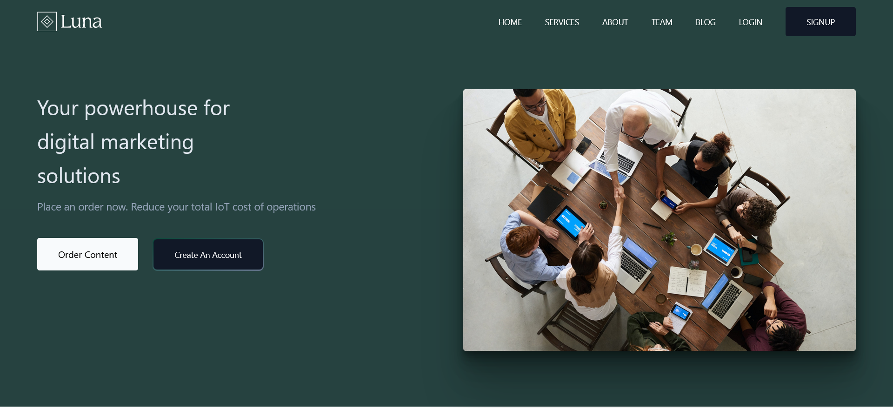

# luna-marketing

## Link to website: 

<a href="https://lunamarketing.netlify.app/" > Luna Marketing </a>

## How It's Made:

     

## Description:

 This is a demo website for a marketing firm. 

